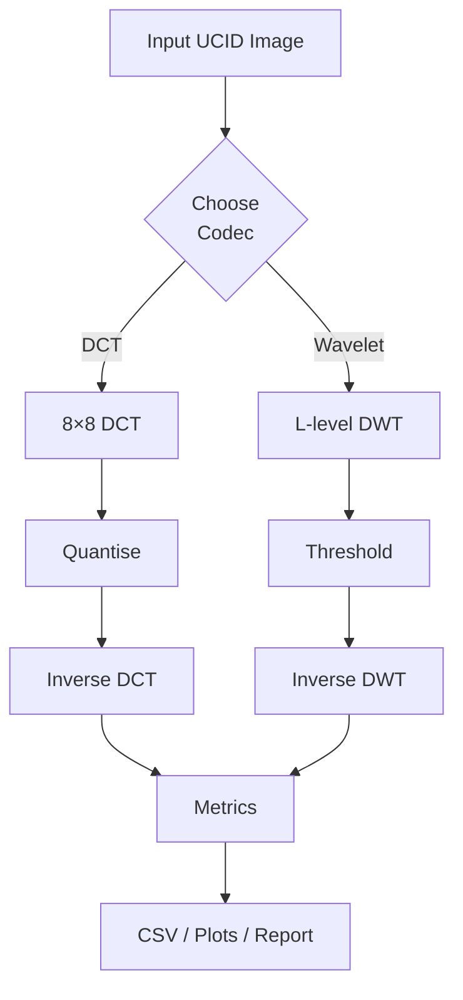

# Comparative Study of Lossy Image Compression Techniques

> **Course**: Digital Image Analysis (CSL7320)   |   **Semester**: AY 2024–25   |   **Project ID**: 9
> **Team**: Ratnesh Dubey (M24CSA027), Ritul Jangir (M24CSA028), Shivani Tiwari (M24CSA029)
> **Guide**: Dr. Bikash Santra, School of AI & DS, IIT Jodhpur

---

## 📜 Description

This repository contains the source code, experiment notebooks, and report assets for a **comparative study of two classical lossy image‑compression families:**

1. **DCT‑based compression (simplified JPEG)** – block‑wise 8 × 8 2‑D Discrete Cosine Transform followed by frequency‑dependent quantisation.
2. **Wavelet‑based compression (simplified JPEG 2000)** – multi‑level 2‑D Discrete Wavelet Transform with adaptive coefficient thresholding.

Both codecs are evaluated on selected **UCID** dataset images in terms of **compression ratio, objective quality (PSNR & SSIM), execution time, and subjective artefact analysis**.  fileciteturn0file0

## 🎯 Goal

*Implement, analyse, and contrast* DCT vs Wavelet approaches to identify which technique is preferable under different compression ratios and application constraints (speed, quality, and artefact tolerance).  fileciteturn0file0

---

## 🏗️ System Architecture

```
             ┌────────────────────┐
             │   Input 8‑bit RGB  │
             │    or grayscale    │
             └─────────┬──────────┘
                       │ (Pre‑process: colour → Y, block/reshape)
 ┌─────────────────────┴─────────────────────┐
 │                                           │
 │            Codec Selection                │
 │   (CLI args / notebook switch)            │
 │                                           │
 └───────┬────────────────────┬──────────────┘
         │                    │
         ▼                    ▼
  ┌──────────────┐     ┌────────────────┐
  │  DCT Codec   │     │ Wavelet Codec  │
  │  • 8×8 DCT   │     │ • L‑level DWT │
  │  • Quantise  │     │ • Threshold   │
  └──────┬───────┘     └───────┬────────┘
         │ Inverse DCT         │ Inverse DWT
         ▼                     ▼
   ┌──────────────┐      ┌──────────────┐
   │ Reconstructed│      │ Reconstructed│
   │    Image     │      │    Image     │
   └──────┬───────┘      └──────┬───────┘
          ▼                    ▼
   ┌──────────────────────────────────────┐
   │ Metric Module: Ratio, PSNR, SSIM    │
   └──────────────────────────────────────┘
```

### Key Components

| Module                  | Responsibilities                                                                                             |
| ----------------------- | ------------------------------------------------------------------------------------------------------------ |
| `dct_compressor.py`     | Block splitting, forward & inverse DCT, standard/ perceptual quantisation, bit‑count–based ratio computation |
| `wavelet_compressor.py` | Multi‑level DWT (Haar & DB4), adaptive percentile thresholding, inverse DWT                                  |
| `metrics.py`            | PSNR, SSIM, subjective score mapping                                                                         |
| `cli.py`                | Command‑line interface to run batch experiments                                                              |
| `notebooks/`            | Colab & Jupyter notebooks for visualisation and plotting                                                     |

---

## 🔄 Data Flow



---

## 📊 Results & Comparison

### Single‑Image ("10.tif", 512 × 384)  fileciteturn0file0

| Method           | Setting | Ratio     | PSNR (dB) | SSIM       | Time (ms) |
| ---------------- | ------- | --------- | --------- | ---------- | --------- |
| DCT (Standard)   | Q=60    | 3.30      | 32.34     | 0.9340     | 235.03    |
| DCT (Perceptual) | Q=60    | 3.85      | 29.98     | 0.9165     | 497.03    |
| Haar Wavelet     | T=30 %  | 3.22      | **36.19** | **0.9470** | **48.49** |
| DB4 Wavelet      | T=30 %  | 3.20      | **36.47** | **0.9514** | 90.19     |
| DCT (Perceptual) | Q=20    | 8.09      | 25.64     | 0.8242     | 290.61    |
| Haar Wavelet     | T=10 %  | 8.75      | 27.81     | 0.7860     | **55.91** |
| DB4 Wavelet      | T=10 %  | 8.59      | 28.20     | 0.8076     | 70.66     |
| DCT (Perceptual) | Q=5     | 24.57     | 22.04     | 0.6304     | 397.60    |
| Haar Wavelet     | T=2 %   | **28.31** | 22.27     | 0.5944     | **56.75** |
| DB4 Wavelet      | T=2 %   | 26.38     | **22.79** | **0.6276** | 53.18     |

### Multi‑Image Average (5 UCID images)  fileciteturn0file0

| Method             | Avg. Ratio | Avg. PSNR (dB) | Avg. SSIM  | Exec. Time   |
| ------------------ | ---------- | -------------- | ---------- | ------------ |
| DCT (Q = 60)       | 5.09       | 31.99          | 0.9242     | *200–400 ms* |
| Wavelet (T = 30 %) | **3.21**   | **39.14**      | **0.9628** | *40–90 ms*   |

#### Key Take‑aways  fileciteturn0file0

* **Wavelets excel** at low‑to‑moderate compression (≤ 4:1), delivering higher PSNR/SSIM and 4–6 × faster execution.
* **DCT with perceptual quantisation** catches up at very high ratios (> 10:1) where low‑frequency preservation dominates.
* DCT produces **blocking & ringing artefacts**; Wavelets introduce **blur but avoid grid patterns**.

---

## 🧩 Future Work

* Integrate **entropy coding** (Huffman/Arithmetic) for complete JPEG/JPEG‑2000 pipelines.
* Explore **hybrid DCT + Wavelet** approaches and modern transforms (e.g., Spline Wavelets).
* Add **learned image codecs** (e.g., auto‑encoder–based) as baselines.

---

## 🔗 Useful Links

* 👉 [Colab Notebook](https://colab.research.google.com/drive/1njkInhbnTG2teeEhI0Xu3A-J03LfHIqv?usp=sharing)
* 🌐 [Streamlit Demo](https://codeneon-compression-techniques-app-4ksrti.streamlit.app/)
